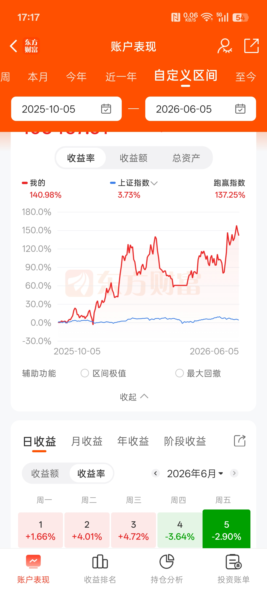
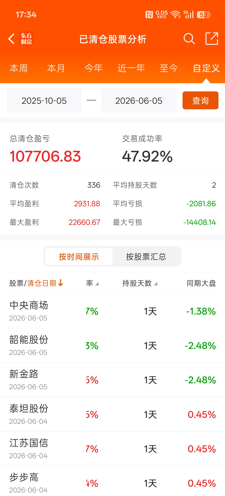

# 半策略教学仓库

不是纯量化，也不是纯手动。代码负责选股和回测，人工负责盘中判断。

**这不是一个完整的量化框架，而是一套从零开始搭建自己半策略的教程。**

适合人群：懂一点 Python、有一定 A 股经验、想把自己模式固定下来但不知道从哪下手的人。

### 你能从这里学到什么

- 如何获取所需的 A 股数据
- 清洗数据、计算技术指标
- 把交易想法写成回测代码
- 调因子参数、看回测结果
- 用代码选股 + 人工二次筛选
- 记录实盘、复盘优化

### 作者

7 年 A 股短线经验，专注短线大票模式。代码 AI 辅助，每一行都看得懂、能改。

### 更新频率

- 不定期更新回测思路
- 每日更新实盘记录
- 每次改因子都会记录改了什么、为什么改、结果如何

## 核心理念

纯量化的缺陷：无法识别题材热度、盘中资金异动、美股联动情绪。
纯手动的缺陷：容易情绪化、回撤失控，无法系统化复盘。

半策略模式：用代码守住纪律，用盘面、市场信号、题材强度等判断时机。两者结合，比单一模式更稳定。

---

## 交易流程

### 第一步：策略代码筛选（公开）

每天收盘后运行选股代码，基于历史回测验证过的条件，从全市场筛选出候选股票。

涉及的技术指标：K线形态、成交量、资金承接度，内外盘比例等。

这部分代码完全公开，可复现。

### 第二步：人工二次筛选（不公开）

从候选池中进一步筛选，依据以下维度：

| 维度 | 说明 |
|---|---|
| 题材强度 | 当前市场主线板块、政策驱动 |
| 分时图形态 | 盘中量价配合、资金承接力度 |
| 盘口数据 | 买卖盘口、大单动向 |
| 市场环境 | 大盘位置、情绪周期 |
| 外围市场 | 隔夜美股、A50期指联动 |

这部分依赖个人经验，无法用代码完全替代，会大概说一下选股各维度的权重思路。

### 第三步：执行
- 买入点：
- 会根据美股走势和竞价情况，还有同板块股票竞价强度综合考虑来大概确定是竞价买入还是开盘选低点买入
- 卖出点：
  1. **竞价直接卖出**：第二天盈利 + 美股大涨 + 板块高开
  2. **成本价附近卖出**：若亏损5%以内，9:50前回到成本价上方则成本价+1%卖出
  3. **9:40均价卖出**：股价在均线上方
  4. **突破均线卖出**：股价一直在均线下方，则突破均线时卖出
  5. **10点强制卖出**：以上都不满足，14点之前有拉升就卖出
- 
- 为了提高资金利用率，在策略模式内股票，卖出一只股票后，若当时股价在均线下方，除非当时是跌停，则可以切换成该股票
- 不设止损和止盈，除非第二天涨停，或者跌停卖不出，第二天都会卖出，不扛票
- 

---

## 回测验证

基于聚宽全 A 股日线数据（5509 支股票），对策略核心条件进行回测和因子分析。
回测区间：2026-04-12 至 2026-06-12，共 2 个月。出于篇幅考虑，这里只展示最近两个月的回测数据，实际对过去半年也做了分段回测验证，结论一致。

### 基础回测（策略原始条件）

**条件**：T-2 涨停 → T-1 没涨停 + 成交额 > 15亿 + M7 / M14 > 1.0 → T 日开盘买入 → T+1 收盘卖出

| 指标 | 数值 |
|---|---|
| 信号总数 | 667 条 |
| 实际交易 | 629 笔 |
| 胜率 | 320 / 629（50.9%） |
| 平均每笔盈亏 | **+1.07%** |
| 最大单笔盈利 | +44.52% |
| 最大单笔亏损 | -16.98% |

### 因子调整对比

以下是对核心因子逐一调整后，回测结果的变化情况：

#### ① 成交额门槛调整

| 成交额 | 交易笔数 | 胜率 | 平均每笔 |
|---|---|---|---|
| > 15亿（基础）| 629 | 50.9% | +1.07% |
| > 20亿 | 490 | 51.6% | +1.14% |
| > 25亿 | 368 | 52.2% | +1.29% |

> 结论：成交额越高单笔收益越好，但信号数量会减少。15亿作为选股门槛，实际买入集中在20亿以上，既有数量又有质量。

#### ② 追加 T-3 也涨停

| 条件 | 交易笔数 | 胜率 | 平均每笔 |
|---|---|---|---|
| 仅 T-2 涨停（基础）| 629 | 50.9% | +1.07% |
| T-2 和 T-3 都涨停 | 112 | 43.8% | +0.90% |

> 结论：连续两天涨停反包的成功率反而下降，说明反包模式更适合断板一天，而非连续涨停后的接力。

#### ③ 实体涨跌幅限制

| 条件 | 交易笔数 | 胜率 | 平均每笔 |
|---|---|---|---|
| 无限制（基础）| 629 | 50.9% | +1.07% |
| 实体涨跌幅 > -3% | 589 | 51.4% | +1.13% |

> 结论：加入实体涨跌幅限制后略微改善，可以作为一个加分项，但不作为硬性门槛。

#### ④ M7 / M14 比值调整

| M7/M14 | 交易笔数 | 胜率 | 平均每笔 |
|---|---|---|---|
| > 1.00（基础）| 629 | 50.9% | +1.07% |
| > 1.05 | 364 | 51.1% | +1.12% |
| > 1.07 | 247 | 51.8% | +1.20% |
| > 1.10 | 131 | 51.1% | +0.91% |

> 结论：M7/M14 在 1.07 附近表现最佳。比值太低混入太多弱势股，比值太高则筛选过严，信号数量不足且位置偏高容易追高被套。

### 最终策略条件（确定版）

综合以上测试，策略确定条件如下：

1. T-2 或 T-3 涨停过（加分项，非硬性要求）
2. T-1 没涨停
3. T-1 成交额 > 15 亿（> 25 亿可加分）
4. M7 / M14 > 1.0（> 1.07 可加分）
5. 实体涨跌幅 > -3%（加分项）
6. 次日竞价或开盘买入，T+1 按卖出规则执行

> 注意：这是初筛条件，实际买入还需结合分时图、盘口承接、题材热度、美股走势等综合判断，详见[交易流程](#交易流程)。

---

## 历史实盘记录

2025年10月至2026年6月，使用本策略手动交易，因资金量比较小，策略当时还处于摸索期，并且好几个买股模式换着买，
都是热门股，波动比较大，导致回撤较大。

*注：可提供券商交割单验证*

2026年6月16日起，重新开立账户，按照这半年多收益不错的反包半策略模式执行，每日更新记录。
---
## 实盘记录

| 项目 | 说明                 |
|---|--------------------|
| 开始日期 | 2026-06-16         |
| 初始资金 | 50,000 元           |
| 交易频率 | 每日 2-4 笔           |
| 记录方式 | 每日更新 trade_log.csv |
| 持仓周期 | T+1                |

记录包含日期、代码、买卖价、盈亏百分比，供复盘使用。

---

## 风险控制

- 严格执行次日卖出纪律，不因盈亏犹豫
- 市场过热时候适当减少仓位，情绪回落后再次启动时增加仓位

---

## 文件结构

| 文件 | 说明 |
|---|---|
| daily_screen.py | 收盘后选股入口 |
| backtest/ | 回测引擎 + 反包回测代码 |
| strategies/ | 策略模块 |
| trade_log.csv | 实盘记录 |
| README.md | 本文件 |

---

## 更新计划

- 每日收盘后更新实盘记录
- 每周整理交易统计
- 每月更新回测报告

## 教学目录

| 教程 | 内容 |
|---|---|
| [01_术语速查](./教程/01_术语速查.md) | 股市术语对应 pandas 代码速查表 |
| [02_因子对比分析](./教程/02_因子对比分析.md) | （待完善）对比不同因子对策略的影响 |

后续会发其他短线策略代码化和因子选股教学，谢谢关注。

（持续更新中）
