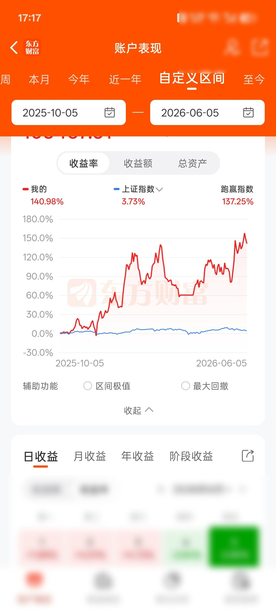

# 反包策略量化项目

> 📓 **求职核心材料：[策略分析 Notebook](./outputs/fanbao_strategy_analysis.ipynb)**
>
> 包含完整的策略逻辑、回测数据、实盘绩效和可视化分析，无需安装直接查看。

A股短线反包策略的量化实现 —— 从策略定义、回测验证到实盘交易的全流程记录。

---

## 项目概述

将一套手工短线交易策略（反包模式 + 板块筛选）逐步代码化、回测化、实盘化，最终形成可复现的半自动化交易流程。

### 技术栈

Python | Pandas | NumPy | Matplotlib | 聚宽数据接口

- 数据清洗与特征计算
- 因子分析与策略回测
- 绩效归因与可视化
- 每日自动化选股

### 核心能力

- 策略回测框架搭建（回测引擎、因子对比、参数调优）
- 金融数据处理（全市场5000+股票日线数据处理）
- 实盘记录与绩效分析
- 统计分析（胜率、夏普比率、最大回撤、盈亏比）

---

## 策略说明

### 反包模式

核心逻辑：选择前一日涨停后断板调整、次日有反包预期的股票进行T+1交易。

**筛选条件：**
1. T-2或T-3日涨停（加分项）
2. T-1日未涨停
3. T-1日成交额 > 15亿
4. 均线多头排列（M7/M14 > 1.0）
5. 实体涨跌幅 > -3%（加分项）

**执行规则：**
- 次日竞价或开盘买入
- T+1按分时图+板块强度+大盘情绪综合判断卖出
- 严格次日卖出纪律，不扛票

---

## 绩效表现

### 实盘记录（2025.10 - 至今）

| **指标**       | **数值**  |
|---------------|----------|
| 累计交易次数   | 357      |
| 胜率          | 47.62%   |
| 平均盈利      | +2875.7  |
| 平均亏损      | -2123.54 |

### 回测验证（2026.04.12 - 2026.06.12）

基于聚宽全A股日线数据（5509支股票）进行两个月分段回测。

| 指标         | 数值         |
|-------------|-------------|
| 信号总数     | 667 条       |
| 实际交易     | 629 笔       |
| 胜率        | 50.9%       |
| 平均每笔收益 | +1.07%      |
| 最大单笔盈利 | +44.52%     |
| 最大单笔亏损 | -16.98%     |

详情见 [backtest/](./backtest/) 目录。

---

## 文件结构

| 文件/目录                | 说明                        |
|------------------------|----------------------------|
| outputs/               | Jupyter 分析报告
| daily_screen.py        | 每日收盘后选股入口              |
| scripts/               | 工具脚本（绩效分析、数据清洗）    |
| strategies/            | 策略模块                      |
| backtest/              | 回测引擎 + 回测代码            |
| trade_log.csv          | 实盘交易记录                   |
| daily_notes/           | 每日复盘与选股逻辑              |
| reports/               | 绩效报告与图表                  |
| 教程/                   | 策略量化教学文档                |
| requirements.txt       | 依赖包列表                     |
| CHANGELOG.md           | 策略迭代记录                    |
| PERFORMANCE_SUMMARY.md | 绩效汇总                       |

---

## 快速开始

`ash
git clone https://github.com/quantjuzi/fanbao_strategy.git
cd fanbao_strategy
pip install -r requirements.txt
python scripts/performance_report.py  # 生成最新绩效报告
# outputs/fanbao_strategy_analysis.ipynb  # 打开策略分析 Notebook
`

---

> 作者：7年A股短线交易经验，擅长反包模式与题材驱动策略。
> 从手工选股到代码实现再到回测验证，完整记录了一个短线策略的量化过程。
> 代码AI辅助，可复现、可验证。

**声明：以上为个人实盘记录与策略研究，不构成投资建议。**
